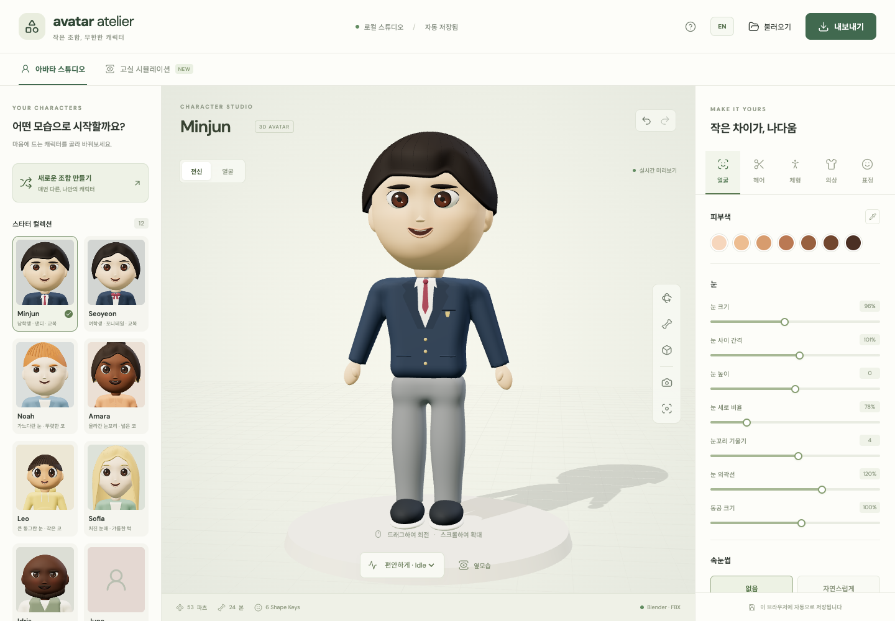
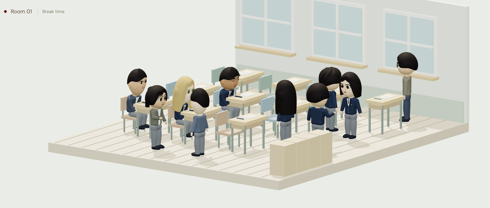

# KULS Avatar Simulator

A simple local 3D avatar studio for creating characters and observing a classroom scene.





## What you can do

- Create a 3D avatar with face, hair, body, clothes, and expressions.
- Start from 12 characters, including Minjun and Seoyeon.
- Rotate and zoom the 3D view.
- Open the classroom simulation to observe a lesson or break time.
- Switch the interface and classroom board between Korean and English.
- Export your avatar as GLB, FBX, Blender, PNG, or JSON.

More screenshots are available in the local [showcase page](public/showcase.html). After starting the app, open `http://127.0.0.1:5173/showcase.html`.

## Install and run

You need Node.js 22.12+ (or Node.js 20.19+) and a modern browser with WebGL support.

```sh
git clone https://github.com/sendmethere/KULS-avatar-generator.git
cd KULS-avatar-generator
npm run setup
npm start
```

Then open [http://127.0.0.1:5173](http://127.0.0.1:5173) in your browser. Stop the app with `Ctrl+C`.

For development with automatic refresh:

```sh
npm run dev
```

## Optional: Blender export

Blender is only needed when exporting `.blend` or `.fbx` files. GLB, PNG, and JSON export work without it.

If Blender is not in your PATH, set its location before starting the app:

```sh
BLENDER_PATH="/path/to/blender" npm start
```

## Project links

- [Showcase page](public/showcase.html)
- [Classroom lesson screenshot](public/showcase/classroom-lesson.png)
- [Classroom break screenshot](public/showcase/classroom-break-closeup.png)

Created by: Taesang Eom (엄태상) · ✉ [sendmethere@naver.com](mailto:sendmethere@naver.com)
