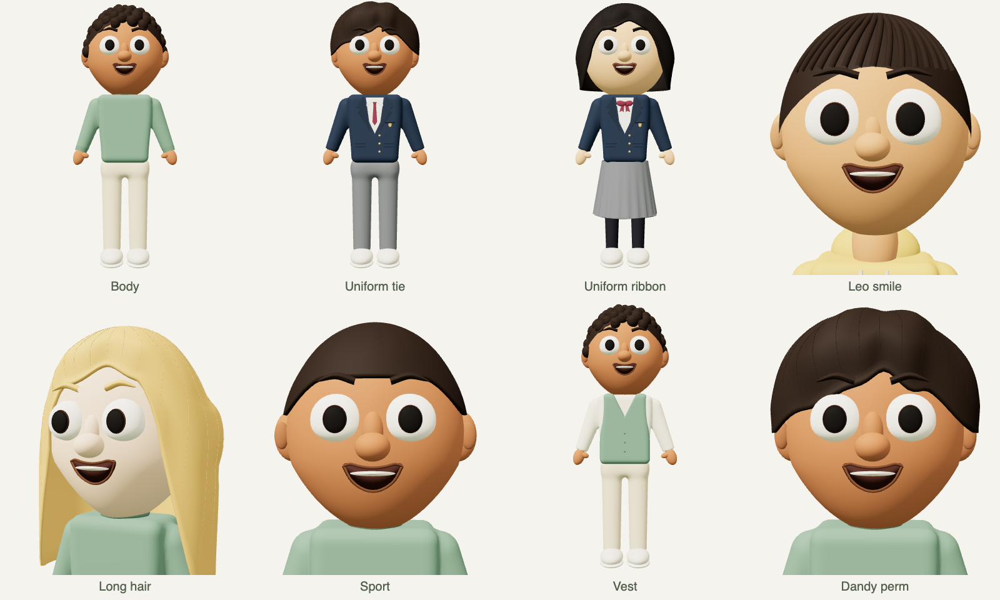

# KULS Avatar Generator

기본 도형을 조합하는 로컬 3D 아바타 제작 스튜디오입니다. 웹에서 조절한 모델을 Blender에서 편집하고 Unity로 옮길 수 있습니다. 생성은 **절차적 도형 조합**이며, 외부 생성형 AI API·사진 분석·텍스트 모델 생성은 연결하지 않았습니다.

## 주요 기능

- 얼굴·헤어·체형·의상·표정의 세부 조절과 12개 스타터 캐릭터(첫 두 캐릭터: `Minjun`, `Seoyeon`).
- 드래그 회전과 스크롤 확대/축소가 가능한 3D 아바타 미리보기, GLB·FBX·Blender·JSON 내보내기.
- **교실 시뮬레이션** 탭: 수업·쉬는 시간의 학생과 교사를 관찰하는 읽기 전용 3D 장면. 카메라 회전·확대/축소를 지원합니다.
- 우측 상단의 `EN` / `한국어` 버튼으로 인터페이스, 활동 인원 표기, 교실 칠판 문구까지 전환하며 선택 언어를 브라우저에 저장합니다.

## 설치 및 실행

이 저장소는 **비공개**입니다. 소유자 또는 초대받은 협업자만 다운로드할 수 있습니다. 웹 브라우저에서 실행하는 로컬 앱이며, GitHub Pages 배포나 전역 npm 패키지 설치는 필요하지 않습니다.

### 준비

- **Node.js 22.12 이상** (22 LTS 권장), npm. Node.js 20을 사용하는 경우 20.19 이상이 필요합니다.
- Chrome/Edge 등 WebGL 지원 브라우저.
- **Blender는 선택 사항**: 웹 편집·GLB/JSON/PNG 저장에는 필요하지 않으며, `.blend`·`.fbx` 변환에는 설치해야 합니다. Blender 5.1에서 검증했습니다.

### 내려받기

GitHub CLI로 로그인한 뒤 복제합니다.

```sh
gh auth login
gh repo clone sendmethere/KULS-avatar-generator
cd KULS-avatar-generator
```

Git을 사용한다면 `git clone https://github.com/sendmethere/KULS-avatar-generator.git`으로 복제할 수도 있습니다. 또는 로그인한 GitHub 저장소 페이지에서 **Code → Download ZIP**을 선택하고 압축을 풉니다.

### 설치·시작

macOS·Windows·Linux 공통 명령:

```sh
npm run setup
npm start
```

`setup`은 잠금 파일 기준으로 의존성을 설치하고 앱을 빌드합니다. 브라우저에서 **http://127.0.0.1:5173**을 여세요. 종료는 터미널에서 Ctrl+C입니다. 첫 설치에는 인터넷이 필요하며, 설치 후 모델 생성은 로컬에서 실행됩니다. 웹 글꼴을 가져올 수 없으면 시스템 글꼴로 대체합니다.

- **macOS**: `start.command`를 더블클릭하면 첫 설치와 빌드 후 브라우저를 엽니다. 실행 권한이 없으면 터미널에서 `chmod +x start.command`를 실행하세요.
- **Windows**: `start.cmd`를 더블클릭하면 첫 설치와 빌드를 진행하고 서버를 시작합니다. 표시된 주소를 브라우저에서 여세요.
- 다른 앱이 5173 포트를 사용 중이면 `PORT` 환경 변수로 포트를 바꿀 수 있습니다. 서버는 `127.0.0.1`에만 연결합니다.

### Blender 연결

macOS의 기본 경로는 `/Applications/Blender.app/Contents/MacOS/Blender`입니다. Windows·Linux에서는 `blender`가 PATH에 있어야 합니다. 다른 경로는 실행 전에 `BLENDER_PATH`를 설정하세요.

macOS / Linux:

```sh
BLENDER_PATH="/path/to/blender" npm start
```

Windows PowerShell (설치 버전에 맞춰 경로 변경):

```powershell
$env:BLENDER_PATH = "C:\Program Files\Blender Foundation\Blender 5.1\blender.exe"
npm start
```

설치 감지는 `http://127.0.0.1:5173/api/health`의 `blender` 값으로 확인할 수 있습니다.

### 업데이트·개발

앱을 종료한 뒤 업데이트합니다. ZIP으로 받은 경우 새 ZIP을 내려받고 같은 설치 명령을 실행하세요.

```sh
git pull --ff-only
npm run setup
npm start
```

소스를 수정하며 실행하려면 `npm run dev`를 사용합니다. `.blend`·`.fbx`·`.glb`와 설정 JSON은 앱의 내보내기로 저장할 수 있습니다. `examples/`에는 편집 가능한 샘플 모델과 설정이 포함되어 있습니다.



## 커스터마이징

- **얼굴**: 피부색, 얼굴 너비·길이, 턱 너비·길이, 광대, 이마, 눈 크기·간격·높이·세로 비율·눈꼬리 기울기·색, 홍채/동공 크기, 눈꺼풀 두께, 속눈썹, 코 크기·너비, 입 너비·위치, 입술 두께.
- 기본 눈은 둥근형과 아래 평평형의 중간 윤곽을 가진 흰자, 넓어진 검은 동공과 얇은 홍채로 구성합니다. 반사광과 홍채 무늬는 없으며 속눈썹은 기본적으로 끕니다. 눈 스타일 목록 없이 크기·간격·세로 비율·기울기를 조절합니다. 표정·눈 깜빡임·시선 이동과 연결됩니다.
- **눈썹**: 두께·길이·높이·간격·기울기·아치·색. 얼굴 탭에서 조절하며 기본 형태에 표정의 변형이 더해집니다.
- **헤어**: 컬/아프로, 짧은 머리, 스포츠, 댄디, 댄디펌, 퀴프, 보브, 긴 머리, 번, 포니테일, 땋은 머리, 웨이브, 민머리, 히잡. 히잡은 랩·드레이프·플리츠 3종이며 겹친 천과 주름을 포함합니다. 볼륨·컬 크기·머릿결 선명도·색, 수염, 안경, 이어링.
- **체형**: 남성적·여성적·중성적 비율, 어린이·성인·노인, 키·체격. 어린이는 별도 어깨 높이를 사용하며 머리 크기에 맞춰 목과 턱 사이 공간을 확보합니다.
- **의상**: 니트·반소매·후디·셔츠·폴로·카디건·재킷·조끼·멜빵·교복 재킷, 기본 바지·반바지·와이드 팬츠·카고·조거·스커트·교복 바지·교복 주름치마, 교복 넥타이/리본, 양말/스타킹, 각 의상과 신발 색.
- **표정**: 보통·웃음·정색·슬픔·화남·당황과 강도. 카툰식 입꼬리·동그란 입·눈썹 과장과 웃음의 치아 표현, 시선 상하·좌우. 자동 눈 깜빡임.
- 12개 스타터, 무작위 생성, 되돌리기/다시 실행, 자동 저장, 설정 JSON 저장/불러오기, PNG 캡처.
- 3D 회전·확대, 얼굴/전신/옆모습, 뼈대·와이어프레임, 기본 자세·T 포즈·Idle·Walk 미리보기.

피부색과 외모 특징은 독립적입니다. 특정 인종을 하나의 얼굴형이나 고정된 설정으로 취급하지 않습니다.

## 내보내기와 Blender

상단 **내보내기**에서 선택합니다.

| 형식 | 용도 |
| --- | --- |
| `.blend` | 로컬 Blender가 GLB를 변환합니다. 별도 메시·재질, Armature, Shape Keys, 애니메이션을 편집합니다. |
| `.fbx` | Unity용 모델. 24개 본, 스키닝, 표정 BlendShapes와 Idle/Walk를 포함합니다. |
| `.glb` | 브라우저에서 직접 생성하는 표준 glTF 바이너리. Blender에서 File → Import → glTF 2.0으로 가져옵니다. |
| `.avatar.json` | 파라미터 설정. 이 스튜디오의 불러오기 버튼으로 복원합니다. |

모델 파일에는 T 포즈 기준의 스켈레톤을 저장합니다. 화면의 포즈/회전/무대는 모델에 포함하지 않습니다. 현재 표정과 시선은 포함하고, Idle과 Walk 애니메이션은 별도 클립으로 저장합니다. 내보내는 동안 미리보기는 영향을 받지 않습니다.

Blender에서:

1. `.blend` 파일을 열거나 `.glb`를 가져옵니다.
2. `Face`, `Hair_*`, `HairStrands_*`, 의상 등 메시를 선택하고 **Edit Mode**에서 수정합니다. 머릿결은 별도 메시여서 숨기거나 삭제할 수 있습니다.
3. `AvatarRig` 선택 → **Pose Mode**에서 뼈를 움직입니다. 파츠는 같은 Armature에 스키닝되어 있습니다.
4. 눈·눈썹·입 메시의 **Object Data Properties → Shape Keys**에서 `smile`, `serious`, `sad`, `angry`, `surprised`, `blink`를 조절합니다. 보통은 모든 키가 0인 기본 형태입니다. 같은 이름의 키를 관련 메시들에서 함께 조절합니다.
5. Blender에서 바꾼 형상은 웹의 파라미터 설정으로 역변환되지 않습니다. 웹으로 돌아올 때는 JSON을 사용하세요.

`examples/`에 기본 Milo, 어린이 Leo, 땋은 머리와 카디건/스커트의 Hana의 `.blend`, `.fbx`, `.glb`, 설정 JSON, 교복 넥타이/리본 모델의 BLEND/FBX/GLB/JSON과 노인·히잡·긴머리 모델의 GLB/JSON이 있습니다.

## Unity

1. `.fbx`를 Unity 프로젝트의 `Assets` 폴더로 복사합니다.
2. 모델 Inspector → **Rig → Animation Type: Humanoid → Avatar Definition: Create From This Model → Apply**.
3. **Configure**에서 본 매핑과 T 포즈를 확인합니다. 본 이름은 `Hips`, `Spine`, `Chest`, `UpperChest`, `Neck`, `Head`, `Left/RightShoulder`, `UpperArm`, `LowerArm`, `Hand`, `UpperLeg`, `LowerLeg`, `Foot`, `Toes`, `Eye`입니다.
4. Animation 탭에서 Idle/Walk를 확인합니다. Animator Controller에 클립을 추가하면 움직임을 재생할 수 있습니다.
5. 표정/시선 제어 예제 `public/unity/AvatarExpressionDriver.cs`를 `Assets`로 복사하고 캐릭터 루트에 붙입니다.
6. 매핑과 반복 설정을 자동으로 하려면 `public/unity/Editor/AvatarAtelierImporter.cs`를 `Assets/Editor`로 복사하고 Project에서 FBX를 선택한 뒤 **Avatar Atelier → Configure selected FBX as Humanoid**를 실행합니다. 선택한 모델만 변경합니다.

URP/HDRP 프로젝트에서는 Unity의 머티리얼 변환 기능이나 해당 파이프라인 셰이더로 머티리얼을 바꾸세요. FBX는 Unity 기본 모델 임포터를 사용할 수 있습니다. GLB를 Unity에서 직접 쓰려면 별도 glTF 임포터가 필요합니다.

검증 환경: Blender 5.1에서 GLB/BLEND/FBX를 다시 열어 본·웨이트·표정·애니메이션을 확인했습니다. GLB 8종은 glTF 검사에서 오류와 경고가 0개였습니다. 설치된 Unity 6000.3.7f1은 활성화된 에디터 라이선스가 없어 자동 실행이 차단되었으므로 Unity 내 Humanoid 매핑과 C# 스크립트 컴파일/재생 검증은 완료하지 못했습니다. Unity 라이선스 활성화 후 Configure에서 확인해 주세요.

## 모델의 범위

이 모델은 참고 이미지처럼 도형이 구분되는 스타일입니다. 머리카락은 편집 가능한 메시이며 헤어 시뮬레이션이나 이미지 텍스처가 아닙니다. 상의와 소매, 바지와 골반은 각각 연결된 메시와 혼합 웨이트를 사용합니다. 상의는 팔을 내린 자세에서 만든 형태를 T 포즈로 역산해 겨드랑이 압축을 줄입니다. 치마와 밑단은 골반과 양쪽 허벅지의 움직임을 혼합하여 기본 걷기에서 관통을 줄입니다. 별도의 천 충돌 시뮬레이션은 없으므로 외부 애니메이션의 큰 동작은 추가 조정이 필요합니다. 긴머리와 보브 등은 두께가 있는 연결된 셸 메시입니다. 손은 단순화된 장갑 형태로 손가락 본은 없습니다. 정밀 손동작, 립싱크/ARKit 52종 표정, 옷감 시뮬레이션, 단일 연결 토폴로지, UV 텍스처 페인팅, LOD는 추가 제작이 필요합니다. 고해상도 스타일용으로 파츠 수와 드로우콜이 많으므로 대규모 NPC 배치에는 메시 결합/LOD 최적화를 권장합니다.

## 검증 및 구조

```sh
npm run build
# 서버가 실행 중일 때, 설치된 Chrome으로 테스트
npm test
node tests/geometry.mjs
node tests/skirt-clearance.mjs
/Applications/Blender.app/Contents/MacOS/Blender --background --factory-startup --python scripts/inspect_blender.py -- examples/Milo.blend examples/Milo.fbx examples/Leo-child.glb
```

테스트는 UI 조절·눈썹·되돌리기·시선·자동 저장·잘못된 설정 처리·모바일 폭, 여덟 가지 체형/헤어/의상 GLB의 glTF 검증, Blender/FBX 변환을 확인합니다. 검증 보고서는 `test-results/`에 생성합니다.

- `src/avatar.js`: 도형 생성, 본, 스키닝, 표정 Shape Key와 애니메이션.
- `src/garment.js`, `src/hair-shell.js`: 연결된 의상과 두께 있는 헤어 메시.
- `src/config.js`: 기본값, 프리셋, 입력 검증.
- `src/main.js`, `src/style.css`: 웹 스튜디오.
- `server.mjs`, `scripts/convert.py`: 로컬 Blender 변환.
- `public/unity/`: Unity 편집기와 런타임 연동 예제.

공식 형식/연동 참고: [Three.js GLTFExporter](https://threejs.org/docs/pages/GLTFExporter.html), [Blender glTF 문서](https://docs.blender.org/manual/en/latest/addons/import_export/scene_gltf2.html), [Unity 휴머노이드 임포트](https://docs.unity3d.com/Manual/ConfiguringtheAvatar.html).
